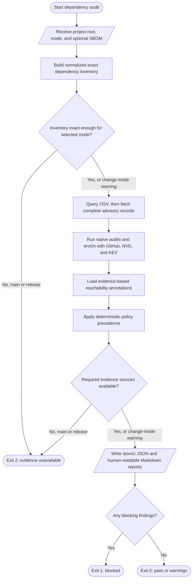

# Design: Dependency Security Audit

<!-- spec-nav:start -->
**Spec navigation:** [State](00_state.md) · [Requirements](01_requirements.md) · [Design](02_design.md) · [Tasks](03_tasks.md) · [Execution](04_execution.md)
<!-- spec-nav:end -->

## Overview

The Dependency Security Audit will be a focused, standalone agent skill backed by a deterministic
Python command-line tool. It builds an exact dependency inventory, correlates package-aware
advisories, records current CISA Known Exploited Vulnerability (KEV) status, incorporates explicit
reachability evidence, and applies one policy engine to both spec-driven and ad hoc use. Every run
produces versioned JSON for automation and a concise Markdown report for human review.

The implementation will use the Python standard library at runtime. Package-manager audit commands
are optional adapters selected from the project evidence; external APIs and data formats are
accessed through narrow clients that can be tested with fixtures. This avoids making the security
gate depend on another unverified runtime library.

> [!IMPORTANT]
> Approval gate: approve this design before work begins on [the task plan](03_tasks.md).

## Design Decisions

1. **OSV is the primary package-aware matcher.** It supports ecosystem/name/version and package URL
   identities with affected-version ranges. GitHub and NVD enrich correlated findings but do not
   replace OSV matching.
2. **KEV is independently authoritative.** A present CVE in the current KEV catalog blocks before
   dependency scope, reachability, or fix availability can downgrade the result.
3. **Evidence availability is separate from vulnerability outcome.** An unavailable required scan
   is not a clean scan and has its own aggregate status and exit code.
4. **Reachability is supplied as reviewable evidence.** The initial version accepts structured
   annotations produced by a human or analysis tool. It will not infer “unreachable” from the
   absence of a direct import.
5. **Policy is deterministic and conservative.** A fixed precedence order makes the same normalized
   finding and project policy produce the same decision and reason codes.
6. **Reports are durable evidence.** Main and release runs retain immutable timestamped results;
   every run also refreshes a stable latest JSON and Markdown report.

## Architecture

The controller owns orchestration but not source-specific parsing or policy. Inventory adapters,
remote clients, reachability loading, classification, and reporting exchange normalized models.
That separation allows source behavior and policy precedence to be tested independently.

### Dependency Audit Gate Flow



## Components and Interfaces

### Command-line controller

The controller validates invocation, constructs services, runs the audit, writes reports, and maps
the aggregate result to a stable exit code. It accepts `--root`, `--mode change|main|release`, an
optional `--sbom`, optional reachability and policy files, and an output directory.

```python
def run_audit(config: AuditConfig, services: AuditServices) -> AuditResult: ...
def main(argv: Sequence[str] | None = None) -> int: ...
```

### Reusable advisory search entry point

A separate lightweight command exposes the normalized source clients without collecting a project
inventory or applying delivery-gate policy. It supports exact package-version searches, advisory
identifier lookup, and current KEV membership lookup:

```text
dependency_advisory_search.py package --ecosystem PyPI --name requests --version 2.19.0
dependency_advisory_search.py advisory --id CVE-2024-1234
dependency_advisory_search.py kev --id CVE-2024-1234
```

Both `--format json` and `--format text` use the same `AdvisorySearchResult`. A completed search
with no records is successful and explicitly empty. Required-source failure is unavailable, not an
empty result. Invalid arguments return the same invalid-invocation status used by the audit CLI.
Search does not classify a project as safe or blocked because it has no resolved inventory or
delivery context.

```python
def search_package(query: PackageQuery, services: SearchServices) -> AdvisorySearchResult: ...
def search_advisory(identifier: str, services: SearchServices) -> AdvisorySearchResult: ...
def search_kev(cve_id: str, services: SearchServices) -> AdvisorySearchResult: ...
```

### Inventory subsystem

Inventory adapters recognize resolved evidence for supported ecosystems and normalize it into one
package graph. The generic CycloneDX JSON adapter consumes component name, version, package URL,
`bom-ref`, and `dependencies[].dependsOn`. Ecosystem-specific adapters may run detected native
commands to preserve exact transitive versions and scope. Unknown scope remains unknown; it is not
silently treated as development-only.

```python
def collect_inventory(
    root: Path,
    sbom_path: Path | None = None,
    runner: CommandRunner = run_command,
) -> InventoryResult: ...
```

The result records adapters attempted, evidence paths, graph edges, completeness reasons, and a
fingerprint over canonical sorted package identities, scopes, and dependency edges. Main and
release mode require a complete exact inventory. Change mode may continue with a prominent
incomplete-evidence warning but cannot report a clean result.

### Vulnerability intelligence clients

Each client returns data plus a `SourceStatus`; network exceptions do not leak across the boundary.

```python
class OsvClient:
    def query(self, packages: Sequence[PackageRef]) -> SourceResult[list[Advisory]]: ...

class GithubClient:
    def enrich(self, advisory: Advisory) -> SourceResult[AdvisoryEnrichment]: ...

class NvdClient:
    def enrich(self, advisory: Advisory) -> SourceResult[AdvisoryEnrichment]: ...

class KevClient:
    def fetch_ids(self) -> SourceResult[frozenset[str]]: ...
```

OSV batch requests use a versioned package URL when available; otherwise they use ecosystem,
package name, and a separate exact version. They never send both a versioned package URL and the
separate version field. Because batch responses contain only vulnerability IDs and modification
timestamps, the client follows pagination and fetches each complete advisory record before
classification.

Complete advisory records preserve every affected package as a separate structure. Each structure
contains its exact ecosystem/name/package-URL identity, explicit affected versions, typed ranges,
ordered range events, and package-specific fixed versions. Correlation unions all OSV evidence and
is independent of response or enrichment order. When an advisory becomes a project `Finding`, the
client projects only the affected structure matching that exact `PackageRef` into the finding's
applicable ranges and fixes; it never pools evidence belonging to another package.

GitHub enrichment prefers exact GHSA lookup and otherwise uses a CVE filter. It can add reviewed
severity, CVSS, EPSS, vulnerable functions, withdrawn state, and first-patched version. A patched
version is applicable only when GitHub's vulnerable-package ecosystem and name match the target
package exactly. NVD adds CVE-level context where available. Neither secondary source is allowed
to remove, overwrite, or weaken OSV affected-package evidence.

The KEV client downloads the current catalog for every main and release run. Its normalized set of
CVE identifiers is checked independently after advisory alias correlation.

### Native audit adapters

Where an installed package manager exposes a current audit command, an adapter invokes it with a
bounded timeout and parses its machine-readable result. Native output supplements OSV and helps
identify ecosystem-specific fixes or metadata. An applicable installed native audit is required in
main and release mode; a missing tool is recorded distinctly from a command failure.

### Reachability evidence loader

Reachability annotations use the stable key `<package-purl>|<advisory-id>` and contain status,
method, evidence references, analyst/tool identity, and timestamp. Accepted statuses are
`reachable`, `unreachable`, `unknown`, and `not_assessed`. An `unreachable` annotation without
concrete exclusion evidence is rejected and becomes `unknown` with a validation diagnostic.

```python
def load_reachability(path: Path | None) -> ReachabilityResult: ...
```

### Policy engine

The policy engine is pure: it receives a normalized finding and effective project policy, then
returns a decision and stable reason codes. Default precedence is:

1. Withdrawn advisory: exclude from block and warning counts; retain provenance.
2. Present KEV: block.
3. Non-KEV with no authoritative fix: warn.
4. Non-KEV development-only dependency: warn.
5. Non-KEV high/critical finding proven unreachable: warn with evidence.
6. High/critical runtime finding with a fix and reachable, unknown, or unassessed reachability:
   block.
7. Medium, low, or unknown severity: warn.

Project policy may promote a warning to a block but may not weaken the default result or KEV rule.
A release containing a no-fix warning is unavailable for release until the report contains both a
documented mitigation and explicit risk acceptance.

```python
def classify_finding(finding: Finding, policy: Policy) -> DecisionRecord: ...
def gate_result(result: AuditResult) -> GateResult: ...
```

### Report writer

The writer serializes a versioned schema to JSON and derives the Markdown report from the same
`AuditResult`, preventing human and machine views from drifting. Writes use a temporary sibling
file followed by an atomic rename. Output defaults to `.security/dependency-audit/` and includes
`latest.json`, `latest.md`, and timestamped evidence for main and release modes.

```python
def write_reports(result: AuditResult, output_dir: Path) -> ReportPaths: ...
```

Remote text is treated as data: Markdown control characters and HTML are escaped or rendered in
code spans, embedded instructions are never evaluated, and authorization headers and configured
credential values are redacted from diagnostics.

### Spec-family integration

The design, task, audit, and execution skills will call the standalone audit contract rather than
reimplementing policy:

- spec design records Context7 and dependency-security evidence for materially selected libraries;
- task contracts that alter resolution own the manifest or lockfile and require Context7,
  change-mode audit, report review, tests, and a re-audit;
- protected-main and release checkpoints require fresh corresponding modes;
- spec audit treats missing required evidence or an unaccepted block as a defect.

## Data Models

| Model | Required fields and purpose |
|---|---|
| `AuditConfig` | Root, mode, optional SBOM/reachability/policy paths, output directory, timeouts, source configuration. |
| `PackageRef` | Ecosystem, name, exact version, optional package URL, dependency scope, direct/transitive flag, and graph reference. |
| `InventoryResult` | Packages, dependency edges, fingerprint, completeness, evidence, adapter diagnostics. |
| `AffectedEvent` | One ordered range transition: `introduced`, `fixed`, `last_affected`, or `limit`, with its version value. |
| `AffectedRange` | Range type, optional repository identity, and ordered events whose sequence is retained exactly. |
| `AffectedPackage` | Ecosystem/name/package-URL identity, explicit affected versions, typed ranges, and fixes that apply only to that package. |
| `AdvisoryEnrichment` | Source-scoped normalized severity, CVSS scores/vectors, EPSS scores, vulnerable functions, and descriptive context retained without changing OSV applicability. |
| `Advisory` | Canonical source ID, OSV/GHSA/CVE aliases, complete package-aware affected evidence, withdrawn status, severities, provenance, and an optional exact-package projection used by a `Finding`. |
| `Finding` | Package, correlated advisory, KEV state, dependency scope, reachability, fix state, enrichment, source timestamps. |
| `DecisionRecord` | `excluded`, `warn`, or `block`; stable reason codes; effective policy; mitigation and risk-acceptance state. |
| `SourceStatus` | Source, `ok|partial|unavailable|not_applicable`, attempted time, freshness/provenance, and sanitized diagnostic. |
| `AuditResult` | Schema version, mode, timestamp, revision, inventory, source statuses, findings, decisions, aggregate status. |
| `GateResult` | `pass`, `warnings`, `blocked`, `unavailable`, or `invalid`; stable exit code and summary counts. |
| `AdvisorySearchResult` | Query kind and normalized input, source statuses, correlated advisories or KEV membership, explicit empty state, and completion status. |

The JSON schema is versioned from `1`. Unknown fields are tolerated by readers, while missing
required fields or an unsupported major schema version fail validation. Timestamps are UTC ISO
8601 values. Package and advisory aliases are sorted before serialization to make fixture output
and fingerprints reproducible.

## Key Flows and Aggregate Status

### Mode behavior

| Mode | Trigger and inventory | Required current evidence | Persistence |
|---|---|---|---|
| `change` | Dependency resolution changed; evaluate the resulting snapshot, with targeted presentation allowed. | Attempt OSV and KEV; source failures warn and prevent a clean label. | Refresh latest reports. |
| `main` | Proposed protected-main integration; complete exact snapshot. | OSV, KEV, complete inventory, and each applicable installed native audit. | Refresh latest and retain timestamped evidence. |
| `release` | Release preparation; fresh complete exact snapshot with no reused decision. | Same as main, plus resolution of release no-fix acceptance requirements. | Refresh latest and retain immutable timestamped evidence. |

An ordinary feature commit whose resolved dependency fingerprint is unchanged does not require a
complete run. The workflow compares the current fingerprint with the relevant baseline rather than
guessing from manifest text alone.

### Aggregate precedence and exits

Aggregate status is evaluated after reports have captured all available evidence:

1. Invalid arguments or malformed required local configuration: `invalid`, exit `3`.
2. Main/release required inventory or source unavailable, or release risk acceptance incomplete:
   `unavailable`, exit `2`.
3. At least one blocking decision: `blocked`, exit `1`.
4. No blocks and at least one warning: `warnings`, exit `0`.
5. Complete scan with neither blocks nor warnings: `pass`, exit `0`.

This ordering means a scan that finds a vulnerability and also lacks required evidence remains
`unavailable`; the report still retains the known blocking decision instead of discarding it.

### Remediation flow

For each affected package, the engine intersects authoritative safe ranges across all applicable
findings and recommends the lowest released version satisfying every range. If the intersection is
empty, it lists each unresolved finding separately. Before implementation changes, the workflow
uses current Context7 guidance for the selected library version. Major-version upgrades and
replacements require explicit user approval. Any dependency resolution change requires relevant
project tests followed by a fresh change-mode audit and report review.

### Advisory search flow

Package search sends the exact ecosystem/name/version identity through OSV and retrieves complete
records before optional GitHub/NVD enrichment. Advisory lookup accepts OSV, GHSA, or CVE IDs and
uses stable aliases to correlate available records. KEV lookup validates a CVE identifier and
checks the current normalized catalog. All modes reuse the bounded HTTP, redaction, alias,
withdrawal, and untrusted-text protections of the audit clients.

Search exit behavior is intentionally narrower than audit enforcement: exit `0` means the query
completed, including an explicit empty result; exit `2` means a required source was unavailable;
exit `3` means invalid invocation. Exit `1` is reserved for an audit policy block and is never
produced by informational search.

## Error Handling and Edge Cases

- HTTP calls use bounded connect/read timeouts, limited retries with jitter for transient failures,
  response-size limits, and explicit pagination limits. Authentication errors are not retried.
- A partial OSV batch is `partial`, not `ok`; main and release become unavailable.
- Withdrawn advisories remain in a provenance section but cannot affect decision counts.
- Conflicting severity values are retained by source. Policy uses the highest authoritative
  normalized severity and records the values that led to it.
- Missing or invalid scope is `unknown`; it cannot qualify for the development-only warning rule.
- Missing reachability annotations become `not_assessed`; absence of imports becomes `unknown`,
  never `unreachable`.
- Missing fix data is `no_fix_known`, not a recommendation to upgrade to the newest release.
- Duplicate aliases merge only when a shared stable identifier or source-declared alias proves the
  relationship. Name similarity alone never merges findings.
- Multi-package advisories retain one affected record per package. Correlation is order-independent,
  unions all OSV records, and rejects secondary fixes that do not match the finding's exact package.
- Failure to write either report makes the invocation unavailable; a partially written latest
  report is prevented by atomic replacement.
- Advisory descriptions, package metadata, and SBOM properties remain untrusted strings and cannot
  influence tool execution or command construction.

## Current Technology Evidence

Current documentation was checked through Context7 on 2026-08-08. The implementation tasks must
repeat a query when an API or schema decision materially changes.

| Technology | Context7 identity / version context | Current-doc question | Design decision |
|---|---|---|---|
| OSV.dev API | `/google/osv.dev`; current hosted v1 API | Exact package queries, batch response shape, pagination, and affected-range events | Use versioned package URL or ecosystem/name plus version, never both; paginate batch results and fetch full records by ID; interpret `introduced`, `fixed`, and `last_affected` events. |
| GitHub REST API | `/websites/github_en_rest`; explicit API-version header | Global advisory filters and returned enrichment fields | Use reviewed global advisories as secondary enrichment via GHSA or CVE; capture severity, CVSS, EPSS, vulnerable functions, withdrawal, and first patched version. |
| CycloneDX Python library documentation | `/cyclonedx/cyclonedx-python-lib`; schema examples include 1.7 | Component identity and dependency-graph representation | Parse the documented JSON subset with the standard library: component name/version/package URL/`bom-ref` and dependency `ref`/`dependsOn`; incomplete versions remain an inventory error. |

## Dependency Security Evidence for This Design

No third-party runtime library is selected for the auditor itself, so there is no new runtime
package version to scan at design time. The Context7 checks above cover the evolving APIs and file
format on which the design relies. The implemented skill must run its own fixture tests and an
opt-in live smoke test before integration; after the standalone audit exists, subsequent changes to
its dependencies are subject to the same policy.

## Testing Strategy

The primary suite uses `unittest`, temporary directories, fake command runners, fake HTTP
transports, and checked-in minimal fixtures. Live network behavior is an opt-in smoke test rather
than the proof of deterministic policy.

- **Inventory tests:** exact direct/transitive graphs, scopes, incomplete versions, canonical
  fingerprints, CycloneDX graphs, and unsupported ecosystems.
- **Client tests:** OSV query shape and pagination, full-record retrieval, alias correlation,
  withdrawal, affected ranges, GitHub/NVD enrichment failures, KEV normalization, timeouts, and
  redaction.
- **Search tests:** exact package queries, OSV/GHSA/CVE lookup, KEV membership and absence,
  explicit empty results, unavailable sources, normalized JSON/text output, and exits `0`, `2`,
  and `3`.
- **Policy table tests:** every precedence combination, stricter project policy, no-fix release
  acceptance, and stable reason codes.
- **Reachability tests:** valid reachable/unreachable evidence, missing exclusion evidence,
  unknown and unassessed states, and conflicting annotations.
- **Report tests:** JSON schema, Markdown escaping and accessibility, matching counts, atomic
  writes, timestamped retention, and stable exit codes.
- **Integration tests:** change/main/release fixtures run end to end without network access and
  assert both report formats and aggregate status.
- **Spec integration tests:** skill text and scripted checks prove required Context7/audit clauses
  appear in dependency-changing task contracts and delivery gates.

## Cross-Cutting Risk Gates

| Gate | Failure mode | Verification | Owner / decision |
|---|---|---|---|
| Security and authorization | Credentials leak, advisory data controls execution, or KEV is downgraded. | Redaction and hostile-string fixtures; policy precedence tests; secrets accepted only by environment-variable name. | Auditor implementation; KEV cannot be overridden. |
| Privacy | Reports contain authorization headers or credential values. | Snapshot tests scan diagnostics and reports for seeded secrets. | Report and transport components. |
| Accessibility | Markdown meaning depends on color or opaque status icons. | Human review and fixtures require descriptive headings, text labels, tables, and evidence links. | Report writer. |
| Performance | Full remote scans run unnecessarily or large graphs cause unbounded work. | Fingerprint-based trigger tests, batching, pagination bounds, response limits, and timing metrics. | Controller and source clients. |
| Observability | A failed or stale source is indistinguishable from success. | Every adapter/source emits status, timestamp, provenance, and sanitized diagnostic; aggregate tests cover partial failure. | Controller. |
| Data migration | Report readers silently misread a future schema. | Major schema version validation and backward-compatible unknown-field tests. | Schema owner. |
| Rollout | New gates unexpectedly stop all work because source access is not configured. | Run warning-only change-mode pilots, then verify main/release connectivity before enabling protected gates. | Repository/release owner. |
| Rollback | Disabling the integration loses audit evidence or weakens policy silently. | Skill changes are reversible; timestamped reports remain; rollback requires an explicit repository-policy change. | Repository/release owner. |

## Rejected Alternatives

- **Use a broad security-review skill as the dependency gate.** Rejected because unrelated checks
  make dependency changes slower and do not provide a stable package-specific machine contract.
- **Use NVD/CPE matching as the primary source.** Rejected because product-name/CPE correlation is
  less precise than ecosystem package and exact-version matching. NVD remains useful enrichment.
- **Install a CycloneDX parsing library at runtime.** Rejected for the first version because it adds
  a dependency to the dependency gate. The documented JSON subset is small enough for a strict
  standard-library parser; external schema validation may be offered as an optional diagnostic.
- **Automatically declare unreachable when no direct import exists.** Rejected because runtime
  loading, transitive calls, configuration, and bundled code make absence of a direct import
  insufficient evidence.
- **Treat all no-fix high/critical findings as blocking.** Rejected to preserve the approved policy:
  non-KEV no-fix findings warn, while releases require explicit mitigations and risk acceptance.

## Correctness Properties

### Property 1: Mode selection and freshness are deterministic

For the same project event, resolved dependency fingerprint, baseline, and requested delivery gate,
the controller selects the same required mode. Dependency-resolution changes trigger change mode;
protected-main and release trigger complete fresh modes; unrelated commits with unchanged resolved
evidence do not require a complete audit.

**Validates: Requirements 1.1, 1.2, 1.3, 1.4**

### Property 2: Inventory identity is exact and reproducible

Every inventoried node has an exact version or the inventory is incomplete. Available scope and
direct/transitive data are preserved, and canonicalization of identical resolved evidence always
produces the same fingerprint.

**Validates: Requirements 2.1, 2.2, 2.3, 2.4**

### Property 3: Advisory correlation preserves truth and provenance

An exact package version is matched through ecosystem-aware affected ranges. Proven aliases merge
into one finding, withdrawn records do not contribute to decisions, and their identifiers and
source provenance remain reportable.

**Validates: Requirements 3.1, 3.2, 3.3, 3.4**

### Property 4: KEV and fix state come from authoritative evidence

Every finding with a CVE alias is checked against the current normalized KEV catalog. Fixed
versions are reported only from authoritative affected-range or patch data; absent fix evidence is
represented as no-fix and never inferred from a newer release number.

**Validates: Requirements 3.5, 3.6, 3.7**

### Property 5: Classification obeys one monotonic precedence

For any normalized finding, KEV blocks first. Otherwise the approved combinations of severity,
runtime/development scope, fix state, and supported reachability yield the documented block or
warning. Stricter project policy may promote but never demote a decision, and release no-fix
warnings require mitigation and explicit acceptance.

**Validates: Requirements 4.1, 4.2, 4.3, 4.4, 4.5, 4.6, 4.7, 4.8**

### Property 6: Reachability cannot be weakened without evidence

Execution evidence produces `reachable`; proven delivered-artifact exclusion with recorded evidence
may produce `unreachable`; inconclusive analysis produces `unknown`. An unsupported unreachable
claim is rejected and cannot lower the decision.

**Validates: Requirements 5.1, 5.2, 5.3, 5.4, 5.5**

### Property 7: Remediation is compatible, current, and re-verified

The recommendation is the lowest released version satisfying every applicable authoritative safe
range, or it names unresolved findings. Before an implementation recommendation, current Context7
guidance is captured; major upgrades or replacements await user approval; any resolution change
must pass relevant tests and a fresh audit.

**Validates: Requirements 6.1, 6.2, 6.3, 6.4, 6.5, 6.6**

### Property 8: Human and machine evidence agree

JSON and Markdown are derived from the same immutable result and agree on source status, findings,
decisions, remediation, acceptance, and aggregate outcome. Main/release retain timestamped evidence,
warnings remain distinct from pass and unavailable, and exit statuses remain stable.

**Validates: Requirements 7.1, 7.2, 7.3, 7.4, 7.5**

### Property 9: Required evidence fails safely

A required inventory, OSV, KEV, or applicable native-audit failure makes main/release unavailable.
Change-mode failures produce named warnings rather than clean results, while secondary enrichment
failures retain primary findings and record their own source status.

**Validates: Requirements 8.1, 8.2, 8.3**

### Property 10: Reports and inputs are non-executable and secret-safe

For any credential value or hostile remote string, neither reports nor diagnostics expose the
credential, and advisory or package content cannot alter commands, configuration, policy, or tool
control flow.

**Validates: Requirements 8.4, 8.5**

### Property 11: The spec workflow carries dependency evidence end to end

Material library choices in design record current Context7 and dependency-security evidence.
Dependency-changing tasks own resolution files and require Context7, change-mode audit, report
review, tests, and re-audit. Main/release checkpoints demand fresh corresponding results, and spec
audit reports missing evidence or unaccepted blocks as defects.

**Validates: Requirements 9.1, 9.2, 9.3, 9.4, 9.5, 9.6, 9.7, 9.8**

### Property 12: Standalone and spec-driven invocations are policy-equivalent

Given identical configuration, dependency evidence, intelligence responses, and reachability
evidence, standalone and spec-driven invocations produce the same normalized inventory,
classification, reports, aggregate status, and exit code.

**Validates: Requirements 9.9**

### Property 13: Advisory search is reusable and evidence-preserving

Given an exact package identity, supported advisory identifier, or CVE KEV query, the search entry
point uses the same normalized and protected source clients as the audit without requiring project
inventory. It distinguishes explicit empty results from unavailable sources and produces stable
JSON or concise text without assigning a delivery-gate decision.

**Validates: Requirements 10.1, 10.2, 10.3, 10.4, 10.5, 10.6**

## Approval Status

The revised design, including the reusable advisory-search interface and package-aware advisory
evidence correction, was approved by the user on 2026-08-08. Material revisions after approval
invalidate later task, audit, and execution approvals.
