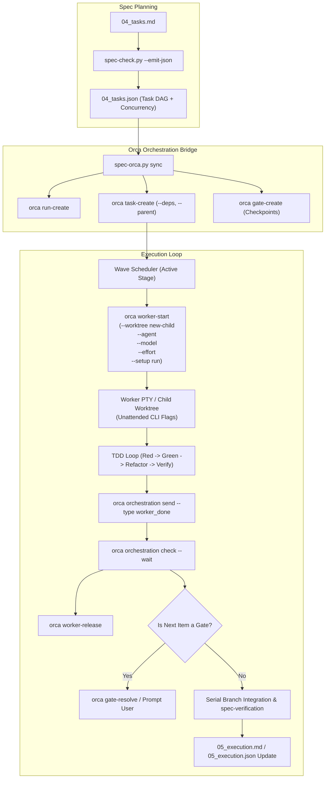

# Discovery: Orca Multi-Agent Task Orchestration

<!-- spec-nav:start -->
**Spec navigation:** [State](00_state.md) · [Discovery](01_discovery.md) · [Requirements](02_requirements.md) · [Design](03_design.md) · [Tasks](04_tasks.md) · [Execution](05_execution.md)
<!-- spec-nav:end -->

## Problem and Outcome

The [`spec-driven`](../../spec-driven/SKILL.md) development skills family provides a deterministic, phase-gated specification pipeline (Discovery → Requirements → Design → Tasks → Audit → Execution → Verification → Finish). While the planning artifacts, contracts ([`contracts/spec-family.yaml`](../../spec-driven/contracts/spec-family.yaml)), and sidecars (`04_tasks.json`, `05_execution.json`) represent tasks as dependency-ordered DAGs, actual multi-agent execution currently relies on abstract subagents or single-thread sequential execution in the coordinator's context window.

This introduces key friction points:
1. **Context Window Saturation**: Complex multi-task implementations and multi-lens audits exhaust conversation context if executed in a single thread.
2. **Interactive Disruption**: Spawning background subagents without explicit autonomous/unattended CLI flags (e.g. `--dangerously-skip-permissions` for Claude Code, `--full-auto` for Codex, `--yolo` for Antigravity) causes workers to halt on terminal confirmation prompts in background PTYs, deadlocking the coordinator loop.
3. **Manual Worktree & PTY Management**: Developers must manually create git worktrees and terminals for parallel tasks rather than having an orchestration harness manage lifecycle, cleanup, and inter-agent messaging.

**Desired Outcome:**
Enable native, zero-disruption task orchestration powered by the Orca runtime daemon (`orca orchestration`). The spec-driven skills will deterministically translate `04_tasks.json` into Orca Runs and Task DAGs, dispatch parallel workers into isolated child worktrees using appropriate unattended CLI flags and model/effort tiers, handle inter-agent communication (`worker_done`, `heartbeat`, `ask`/`reply`), enforce checkpoint decision gates (`gate-create`), and synchronize telemetry directly into [05_execution.md](05_execution.md) / `05_execution.json`—while maintaining 100% graceful fallback to local sequential execution when Orca is absent.

## Users and Current Workaround

- **Users:** Developers, autonomous AI agents, and multi-agent teams using Claude Code, Codex, Antigravity, Cursor, and related tools to plan and execute complex software features.
- **Current Workaround:**
  - Running multi-stage task lists sequentially in a single agent session, leading to frequent context compaction.
  - Manually branching git worktrees, opening separate terminal tabs, and copy-pasting task prompts into sub-agents by hand.
  - Simulating multi-agent audits by serializing different review lenses one after another.

## Scope and Non-Goals

### In-Scope
1. **Orca Runtime Adapter Contract**: Formally define `orca` under `runtime_adapters` in [`contracts/spec-family.yaml`](../../spec-driven/contracts/spec-family.yaml), including worker roles, isolation policies, and structured messaging schemas.
2. **Agent CLI Flag Profiles**: Define canonical unattended execution, model selection, reasoning effort, and session hygiene flags for major coding agents (Claude Code, OpenAI Codex, Antigravity/Gemini, Cursor, OpenCode/Pi) to guarantee disruption-free worker launches.
3. **Reference Documentation**: Author references for Orca orchestration and Agent CLI flags under [`spec-driven/references/`](../../spec-driven/references) detailing exact command surfaces, lifecycle preambles, and recovery patterns.
4. **Skill Enhancements**:
   - [`spec-execute`](../../spec-execute/SKILL.md): Supervised coordinator loop using `worker-start`, `check --wait`, and `worker-release` for parallel waves.
   - [`spec-audit`](../../spec-audit/SKILL.md): Parallel multi-lens audit dispatches (Traceability, Technical/Factual, Adversarial) via isolated reviewer terminals.
   - [`spec-tasks`](../../spec-tasks/SKILL.md): Validation of orchestration metadata and checkpoints.
   - [`spec-finish`](../../spec-finish/SKILL.md): Automated worktree recycling and cleanup upon merge.
5. **Deterministic Python Bridge Tooling**: Extend tooling (e.g. `scripts/spec-orca.py` or `spec-check.py --orca-sync`) to read `04_tasks.json` and deterministically emit or register Orca Runs, Tasks, and Decision Gates.
6. **Graceful Fallback**: Unconditional support for environments without Orca installed.

### Non-Goals
- Altering the core Markdown planning artifact grammar (EARS criteria, requirement numbering, bidirectional traceability).
- Making Orca a mandatory prerequisite for using spec-driven skills.
- Creating a proprietary background daemon (Orca's existing binary `/opt/homebrew/bin/orca` and daemon provide the runtime RPC).

## Constraints and Success Measures

### Constraints
- **Vendor & Tool Portability**: Must work cleanly across Claude Code, Codex, Antigravity, Cursor, and VS Code Copilot.
- **Fail-Safe Operation**: A worker failure, crash, or unexpected termination must be captured as structured failure evidence in [05_execution.md](05_execution.md) without wedging the coordinator.
- **Zero Token Waste**: Worker context packets must adhere to bounded context envelopes (cited requirements, owned files, task contract only—never full conversation transcripts).

### Success Measures
- **100% Automated DAG Translation**: `04_tasks.json` converts directly into an Orca Run with accurate dependency bindings (`--deps`) and parent-child hierarchies.
- **Zero Unattended Halts**: Zero instances of worker deadlocks due to unhandled terminal confirmation prompts.
- **Verified Parallel Wave Execution**: Ready parallel-safe tasks run concurrently in isolated child worktrees and settle via structured `worker_done` payloads.

## Approaches Considered

| Approach | Benefits | Costs / risks | Reversibility | Decision |
|---|---|---|---|---|
| **1. Native Orca Integration with Agent CLI Profiles & Python Bridge (Recommended)** | Direct use of Orca's RPC daemon (`run-*`, `task-*`, `worker-*`, `gate-*`), full worktree isolation, live PTY supervision, deterministic CLI flag profiles, and machine-readable bridge script. | Requires maintaining agent CLI flag compatibility matrix across tool versions. | High (pure additive adapter; non-Orca fallback remains intact). | **Accepted** |
| **2. Prose-Only Skill Updates without CLI Profiles or Bridge Script** | Minimal code edits to repo; only documentation changes in `SKILL.md` files. | High risk of interactive disruption when agents omit bypass flags; coordinators must manually invoke dozens of CLI commands with room for typo errors. | High | **Rejected** |
| **3. Custom Daemon / Background Process Manager** | Full control over PTY multiplexing without depending on Orca CLI. | High development and maintenance burden; reinvents worktree management, terminal splits, and RPC delivery already solved by Orca. | Low | **Rejected** |

## Chosen Direction

We will implement **Approach 1**:
1. Add the `orca` runtime adapter and `agent_profiles` to [`contracts/spec-family.yaml`](../../spec-driven/contracts/spec-family.yaml).
2. Author detailed reference guides for Orca Orchestration and Agent CLI Flags.
3. Build a deterministic Python bridge utility (`scripts/spec-orca.py`) that handles DAG synchronization, worker command generation, and status reconciliation.
4. Upgrade [`spec-execute`](../../spec-execute/SKILL.md), [`spec-audit`](../../spec-audit/SKILL.md), [`spec-tasks`](../../spec-tasks/SKILL.md), and [`spec-finish`](../../spec-finish/SKILL.md) to leverage Orca orchestration whenever the `orca` binary is detected.

## Architecture and Flow Outline

## Failure and Verification Strategy

1. **Worker Failure or Crash**: If an agent process exits nonzero, Orca records the dispatch as failed. The coordinator reads the buffered PTY transcript via `orca terminal read --terminal <handle>` and logs the failure into `execution/task-<id>-report.md`, initiating autonomous task repair within the resolved `self_repair_rounds` budget.
2. **Interactive Halt Detection**: If `orca terminal wait --for tui-idle` times out or no heartbeat is received within the watchdog window (default: 20 minutes), the coordinator flags potential interactive blocking, inspects the terminal buffer, and releases/re-dispatches with explicit bypass flags.
3. **Verification Suite**:
   - Unit tests covering `spec-orca.py` DAG generation, CLI flag assembly, and model/effort parameter mapping.
   - Mock integration tests validating JSON sidecar synchronization with Orca Task statuses.

## Open Decisions

1. **Bridge Tooling Scope**: Whether to implement `spec-orca.py` as a standalone script under [`spec-driven/scripts/`](../../spec-driven/scripts) or integrate `--orca-sync` directly into `spec-check.py`. *(Recommendation: Standalone `scripts/spec-orca.py` for modularity, importing `spec-check.py` and `model-router.py` in-process).*
2. **Default Agent Detection**: When `--agent` is not explicitly specified by user or task contract, resolve default agent from current environment (`claude`, `codex`, or `agy`).

## Approval

Status: **Approved on 2026-08-10**
