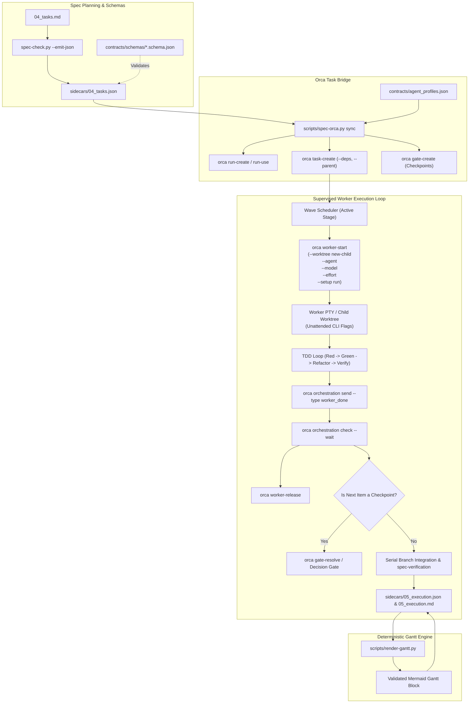

# Design: Orca Multi-Agent Task Orchestration

<!-- spec-nav:start -->
**Spec navigation:** [State](00_state.md) · [Discovery](01_discovery.md) · [Requirements](02_requirements.md) · [Design](03_design.md) · [Tasks](04_tasks.md) · [Execution](05_execution.md)
<!-- spec-nav:end -->

## Overview

This technical design specifies the architecture, data contracts, and operational mechanisms for integrating the Orca runtime daemon (`orca orchestration`) into the [`spec-driven`](../../spec-driven/SKILL.md) development skills family. It introduces a **Sidecar-First Architecture** with formal JSON Schemas, an automated Python task-to-DAG bridge (`scripts/spec-orca.py`), canonical unattended agent CLI profiles ([`contracts/agent_profiles.json`](../../spec-driven/contracts/agent_profiles.json)), isolated child worktree worker placement, a supervised coordinator event loop, and a deterministic, script-driven Mermaid Gantt generator (`scripts/render-gantt.py`).

## Architecture and Component Breakdown



### Core Components

1. **Orca Task Bridge (`scripts/spec-orca.py`)**:
   - Ingests [`sidecars/04_tasks.json`](sidecars/04_tasks.json), reads task dependencies, parents, and checkpoints.
   - Enforces strict dependency blocking: ensures child tasks cannot execute until all prerequisite dependency tasks are settled and verified.
   - Translates DAG nodes into `orca orchestration task-create` with `--deps '["<dep_id>"]'` and `--parent "<parent_id>"`.
   - Exposes subcommands: `sync`, `status`, `dispatch-ready`, and `reconcile`.

2. **Agent CLI Profile Registry ([`spec-driven/contracts/agent_profiles.json`](../../spec-driven/contracts/agent_profiles.json))**:
   - Stores canonical unattended execution flags, model selection flags, reasoning effort flags, and role-specific overrides across Claude Code (verified via Context7 `/websites/code_claude`), OpenAI Codex, Antigravity, Cursor CLI, and OpenCode.
   - Provides helper API to construct zero-disruption CLI commands (`--dangerously-skip-permissions`, `--full-auto`, `--yolo`).

3. **Guarded Wave Scheduler & Dependency Gatekeeper ([`spec-execute`](../../spec-execute/SKILL.md))**:
   - Manages concurrent wave dispatch: tasks in the current stage with `Delegation: parallel-safe` and zero pending dependencies are dispatched concurrently into isolated child worktrees (`--worktree new-child --setup run`).
   - Tasks with unfulfilled dependencies are blocked from dispatch until dependencies reach verified completion (`checked: true`).
   - Tasks with `Delegation: sequential subagent` execute sequentially in the coordinator's current worktree (`--worktree current`).
   - Resolves model and effort tiers deterministically from [`spec-driven/scripts/model-router.py`](../../spec-driven/scripts/model-router.py).

4. **Iterative Plan Repair & Supervised Worker Event Loop ([`spec-execute`](../../spec-execute/SKILL.md) & [`spec-audit`](../../spec-audit/SKILL.md))**:
   - If plan errors or verification failures occur, agents iteratively attempt to self-repair plan bugs (up to `self_repair_rounds`) using diagnostics emitted in `audit_findings.json` and `spec-check.py`.
   - Supervises active worker terminals via rolling `orca orchestration check --wait --types worker_done,escalation,question`.
   - Dispatches parallel reviewer terminals for multi-lens audits and merges structured verdicts.
   - Automatically releases settled worker terminals via `orca orchestration worker-release`.

5. **Deterministic Gantt Generator (`scripts/render-gantt.py`)**:
   - Reads [`sidecars/05_execution.json`](sidecars/05_execution.json) timing rows and [`sidecars/04_tasks.json`](sidecars/04_tasks.json) schedule estimates.
   - Converts intervals into Mermaid Gantt IR, validates syntax deterministically, handles 0-second tasks safely, and updates [05_execution.md](05_execution.md) without manual transcription.

6. **Comprehensive Sidecar Validator ([`spec-driven/scripts/spec-check.py`](../../spec-driven/scripts/spec-check.py))**:
   - Validates all sidecars in [`sidecars/`](sidecars) against [`spec-driven/contracts/schemas/`](../../spec-driven/contracts/schemas).
   - Performs 3-way in-memory traceability validation (`02_requirements.json` ↔ `03_design.json` ↔ [`sidecars/04_tasks.json`](sidecars/04_tasks.json)).

7. **Budget & Quota Inspector ([`spec-driven/scripts/model-router.py`](../../spec-driven/scripts/model-router.py) & `scripts/spec-orca.py`)**:
   - Inspects available token/credit quotas, provider usage limits, or rate limit tiers before resolving agent models.
   - Dynamically down-tiers non-critical tasks (`code_analysis`, `quick_response`, `documentation`, `unit_test`) to budget-efficient models when quotas are constrained.
   - Deferentially schedules tasks and enters a sleep/wait state when credits are exhausted or cooldowns are active.

---

## Data Models and Sidecar Organization

### Dedicated Sidecar Directory Layout

To maintain a clean separation of concerns, human-facing Markdown documents live at the feature root while machine-readable JSON sidecars live in the [`sidecars/`](sidecars) subfolder:

```
.specs/<feature-slug>/
├── 00_state.md
├── 01_discovery.md
├── 02_requirements.md
├── 03_design.md
├── 04_tasks.md
├── 05_execution.md
└── sidecars/
    ├── 00_state.json
    ├── 01_discovery.json
    ├── 02_requirements.json
    ├── 03_design.json
    ├── 04_tasks.json
    ├── 05_execution.json
    ├── audit_findings.json
    └── orca_run.json
```

### JSON Schemas in [`contracts/schemas/`](../../spec-driven/contracts/schemas)

1. [`00_state.schema.json`](../../spec-driven/contracts/schemas/00_state.schema.json): Phase gates (`discovery`, `requirements`, `design`, `tasks`, `audit`, `execution`) and change control logs.
2. [`01_discovery.schema.json`](../../spec-driven/contracts/schemas/01_discovery.schema.json): Problem, outcome, scope boundaries, approaches comparison, and chosen direction.
3. [`02_requirements.schema.json`](../../spec-driven/contracts/schemas/02_requirements.schema.json): User stories and structured EARS criteria.
4. [`03_design.schema.json`](../../spec-driven/contracts/schemas/03_design.schema.json): Architecture components, correctness properties with `validates_requirements`, technology evidence, and dependency security evidence.
5. [`04_tasks.schema.json`](../../spec-driven/contracts/schemas/04_tasks.schema.json): Task DAG, stages, dependencies, files, interfaces, model routing, and Orca dispatch configurations.
6. [`05_execution.schema.json`](../../spec-driven/contracts/schemas/05_execution.schema.json): Run intervals, task attempt intervals, Gantt IR, and Orca telemetry.
7. [`agent_profiles.schema.json`](../../spec-driven/contracts/schemas/agent_profiles.schema.json): Unattended agent CLI flags, model flags, and reasoning effort mappings.
8. [`audit_findings.schema.json`](../../spec-driven/contracts/schemas/audit_findings.schema.json): P0/P1/P2 findings, CERTAIN/UNCERTAIN classifications, review lenses, and fix diffs.
9. [`orca_run.schema.json`](../../spec-driven/contracts/schemas/orca_run.schema.json): Live Orca Run ID, task mappings (`spec_id` -> `orca_task_id`), dispatches, and decision gates.

---

## Agent CLI Profiles and Launch Matrix

To eliminate interactive terminal deadlocks during unattended background worker execution, the system configures each agent CLI with explicit non-interactive flags:

| Agent | Binary | Role | Unattended Launch Arguments |
|---|---|---|---|
| **Claude Code** | `claude` | Implementer | `claude --dangerously-skip-permissions --model <model> --effort <effort>` |
| **Claude Code** | `claude` | Reviewer | `claude --permission-prompt-tool-allowlist View,Read,Grep,Glob,Search --model <model> --effort <effort>` |
| **OpenAI Codex** | `codex` | Implementer | `codex --full-auto --model <model> -c model_reasoning_effort="<effort>"` |
| **OpenAI Codex** | `codex` | Reviewer | `codex --sandbox read-only --model <model> -c model_reasoning_effort="<effort>"` |
| **Google Antigravity** | `agy` | Implementer | `agy --yolo --auto-approve --model <model> --thinking <effort>` |
| **Cursor CLI** | `cursor-agent` | Implementer | `cursor-agent --approve-all --headless --model <model> --thinking-level <effort>` |
| **OpenCode / Pi** | `opencode` | Implementer | `opencode --auto-confirm --yes --model <model> --reasoning <effort>` |

---

## Correctness Properties

**Property P1: Runtime Adapter & Agent CLI Profiles**
The [`spec-driven/contracts/spec-family.yaml`](../../spec-driven/contracts/spec-family.yaml) contract and [`spec-driven/contracts/agent_profiles.json`](../../spec-driven/contracts/agent_profiles.json) define canonical unattended execution flags, model flags, and reasoning effort flags across all supported coding agents.
**Validates: Requirements 1.1, 1.2, 1.3, 1.4, 1.5**

**Property P2: Task DAG Ingestion & Orca Run Synchronization**
The `spec-orca.py` bridge script deterministically translates [`sidecars/04_tasks.json`](sidecars/04_tasks.json) dependencies, parent stages, and checkpoints into Orca Runs, Tasks (`--deps`, `--parent`), and Decision Gates (`gate-create`).
**Validates: Requirements 2.1, 2.2, 2.3, 2.4, 2.5**

**Property P3: Deterministic Worker Placement & Worktree Isolation**
Parallel-safe tasks run in isolated child worktrees via `orca orchestration worker-start --worktree new-child --setup run`, sequential subagents run in the current worktree, and TUI agent startup waits for `tui-idle` before dispatching prompts.
**Validates: Requirements 3.1, 3.2, 3.3, 3.4**

**Property P4: Supervised Worker Lifecycle & Structured Return Protocol**
The coordinator supervises active workers via `orca orchestration check --wait`, handles questions (`ask`/`reply`), verifies structured `worker_done` returns, releases settled terminals, and bounds repairs within `self_repair_rounds`.
**Validates: Requirements 4.1, 4.2, 4.3, 4.4, 4.5**

**Property P5: Parallel Multi-Lens Audit & Hardening**
[`spec-audit`](../../spec-audit/SKILL.md) resolves reviewer fan-out via [`spec-driven/scripts/fanout.py`](../../spec-driven/scripts/fanout.py), dispatches concurrent reviewer terminals, and merges structured `review_verdict` returns into CERTAIN/UNCERTAIN findings.
**Validates: Requirements 5.1, 5.2, 5.3**

**Property P6: Telemetry Synchronization & Graceful Fallback**
Observed start and stop timestamps from Orca telemetry sync directly to [05_execution.md](05_execution.md) / [`sidecars/05_execution.json`](sidecars/05_execution.json), while non-Orca environments fall back gracefully to local sequential execution.
**Validates: Requirements 6.1, 6.2, 6.3**

**Property P7: Comprehensive JSON Sidecars & Traceability**
All spec phases generate and validate JSON sidecars, supporting 3-way in-memory traceability validation (`02_requirements.json` ↔ `03_design.json` ↔ `04_tasks.json`).
**Validates: Requirements 7.1, 7.2, 7.3, 7.4, 7.5**

**Property P8: Formal JSON Schema System & Dedicated Sidecar Directory**
Formal JSON Schemas in [`spec-driven/contracts/schemas/`](../../spec-driven/contracts/schemas) validate every sidecar, and all sidecar files reside in the dedicated [`sidecars/`](sidecars) folder.
**Validates: Requirements 8.1, 8.2, 8.3**

**Property P9: Deterministic and Scripted Gantt Chart Generation**
The `render-gantt.py` script automatically derives, validates, and injects syntax-error-free Mermaid gantt charts into [05_execution.md](05_execution.md) whenever schedules or execution intervals change.
**Validates: Requirements 9.1, 9.2, 9.3**

**Property P10: Budget, Quota, and Usage-Aware Model Routing and Deferred Scheduling**
The [`spec-driven/scripts/model-router.py`](../../spec-driven/scripts/model-router.py) and `spec-orca.py` scripts inspect available credits and provider quotas, dynamically down-tiering non-critical tasks to economical models or deferring execution when rate limits or quotas are exhausted.
**Validates: Requirements 10.1, 10.2, 10.3**

---

## Current Technology Evidence

Consulted Context7 identity `/websites/code_claude` for version `v2.1.89` to verify unattended CLI execution flags.
Decision: Pass `--dangerously-skip-permissions` for implementers and `--permission-prompt-tool-allowlist` for reviewers to eliminate interactive prompt freezes.

| Technology | Context7 identity/source | Exact selected version | Current-doc question | Decision |
|---|---|---|---|---|
| Orca Orchestration CLI | `/orca/cli` | v2.0.0 | `orchestration run-create, task-create, worker-start, check --wait, gate-create` | Use Orca orchestration CLI as the primary multi-agent orchestration runtime. |
| Claude Code CLI | `/websites/code_claude` | v2.1.89 | `--dangerously-skip-permissions, --model, --effort, -p` | Pass `--dangerously-skip-permissions` for implementers to eliminate interactive prompt freezes. |
| OpenAI Codex CLI | `/websites/developers_openai` | v1.0.0 | `--full-auto, -c model_reasoning_effort=` | Pass `--full-auto` and `-c model_reasoning_effort=` to automate tool approvals and control reasoning. |

---

## Dependency Security Evidence

No external dependencies or libraries are required or relied upon because this feature uses only the Python standard library.

---

## Approval

Status: **Draft** (Awaiting user review and approval before proceeding to Phase 4: Tasks)
