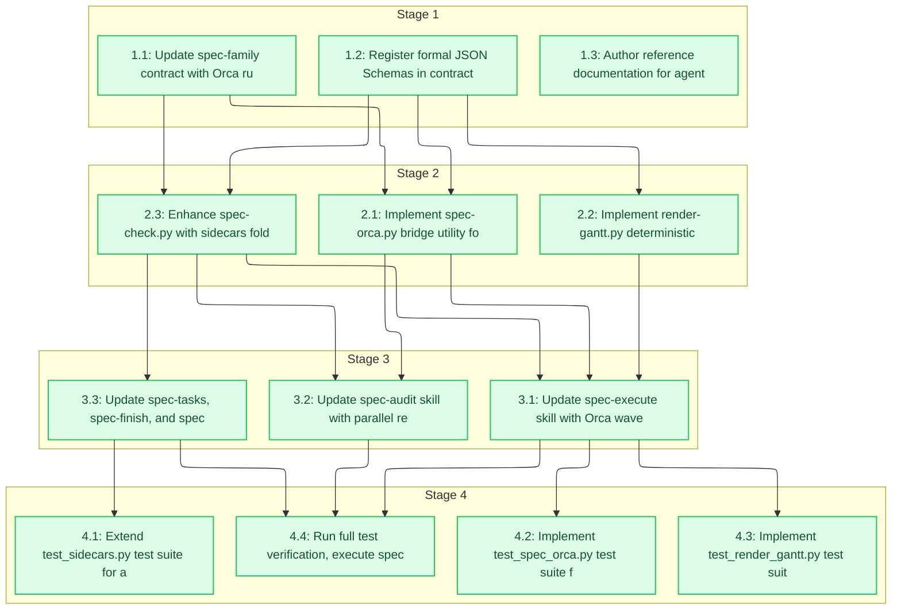

# Tasks: Orca Multi-Agent Task Orchestration

<!-- spec-nav:start -->
**Spec navigation:** [State](00_state.md) · [Discovery](01_discovery.md) · [Requirements](02_requirements.md) · [Design](03_design.md) · [Tasks](04_tasks.md) · [Execution](05_execution.md)
<!-- spec-nav:end -->

## Stage and Dependency Overview

## Stage 1: Contract, Schemas & Reference Foundations

- [x] 1. Foundations and Core Schemas
  - [x] 1.1 Update spec-family contract with Orca runtime adapter and agent profiles schema
    - **Files:** [`spec-driven/contracts/spec-family.yaml`](../../spec-driven/contracts/spec-family.yaml)
    - **Dependency resolution:** none
    - **Dependency delivery:** none
    - **Depends on:** none
    - **Stage:** 1
    - **Interfaces:** Consumes: [`03_design.md`](03_design.md); Produces: runtime adapter schema and agent profile definitions in [`spec-driven/contracts/spec-family.yaml`](../../spec-driven/contracts/spec-family.yaml)
    - **Documentation:** no public surface
    - **Verification:** pytest spec-driven/tests/test_model_routing.py
    - **Estimated effort:** 15-30 minutes
    - **Risk:** low; backward-compatible yaml schema additions
    - **Task category:** architecture_design
    - **Delegation:** sequential subagent
    - _Requirements: 1.1, 1.2, 1.3, 1.4, 1.5, 10.1, 10.2_

  - [x] 1.2 Register formal JSON Schemas in contracts/schemas/ and create canonical agent_profiles.json
    - **Files:** [`spec-driven/contracts/schemas/00_state.schema.json`](../../spec-driven/contracts/schemas/00_state.schema.json), [`spec-driven/contracts/schemas/01_discovery.schema.json`](../../spec-driven/contracts/schemas/01_discovery.schema.json), [`spec-driven/contracts/schemas/02_requirements.schema.json`](../../spec-driven/contracts/schemas/02_requirements.schema.json), [`spec-driven/contracts/schemas/03_design.schema.json`](../../spec-driven/contracts/schemas/03_design.schema.json), [`spec-driven/contracts/schemas/04_tasks.schema.json`](../../spec-driven/contracts/schemas/04_tasks.schema.json), [`spec-driven/contracts/schemas/05_execution.schema.json`](../../spec-driven/contracts/schemas/05_execution.schema.json), [`spec-driven/contracts/schemas/agent_profiles.schema.json`](../../spec-driven/contracts/schemas/agent_profiles.schema.json), [`spec-driven/contracts/schemas/audit_findings.schema.json`](../../spec-driven/contracts/schemas/audit_findings.schema.json), [`spec-driven/contracts/schemas/orca_run.schema.json`](../../spec-driven/contracts/schemas/orca_run.schema.json), [`spec-driven/contracts/agent_profiles.json`](../../spec-driven/contracts/agent_profiles.json)
    - **Dependency resolution:** none
    - **Dependency delivery:** none
    - **Depends on:** none
    - **Stage:** 1
    - **Interfaces:** Consumes: [`03_design.md`](03_design.md) data models; Produces: 9 JSON schemas and canonical agent CLI flag matrix in [`spec-driven/contracts/agent_profiles.json`](../../spec-driven/contracts/agent_profiles.json)
    - **Documentation:** no public surface
    - **Verification:** python3 -c 'import json, glob; [json.load(open(f)) for f in glob.glob("spec-driven/contracts/schemas/*.json")]'
    - **Estimated effort:** 20-30 minutes
    - **Risk:** low; valid JSON Schema specifications
    - **Task category:** code_analysis
    - **Delegation:** parallel-safe
    - _Requirements: 7.1, 7.2, 7.3, 8.1, 8.2_

  - [x] 1.3 Author reference documentation for agent CLI flags and Orca orchestration
    - **Files:** [`spec-driven/references/agent-cli-flags.md`](../../spec-driven/references/agent-cli-flags.md), [`spec-driven/references/orca-orchestration.md`](../../spec-driven/references/orca-orchestration.md)
    - **Dependency resolution:** none
    - **Dependency delivery:** none
    - **Depends on:** none
    - **Stage:** 1
    - **Interfaces:** Consumes: Context7 research and Orca CLI surface; Produces: markdown reference guides in [`spec-driven/references/`](../../spec-driven/references)
    - **Documentation:** developer reference guides
    - **Verification:** test -f spec-driven/references/agent-cli-flags.md && test -f spec-driven/references/orca-orchestration.md
    - **Estimated effort:** 15-25 minutes
    - **Risk:** low; documentation only
    - **Task category:** code_analysis
    - **Delegation:** parallel-safe
    - _Requirements: 1.1, 1.2, 1.3, 1.4, 1.5, 2.1_

## Stage 2: Orchestration Tooling & Sidecar Automation

- [x] 2. Tooling Implementation
  - [x] 2.1 Implement spec-orca.py bridge utility for Run, DAG, and Decision Gate synchronization
    - **Files:** [`spec-driven/scripts/spec-orca.py`](../../spec-driven/scripts/spec-orca.py)
    - **Dependency resolution:** none
    - **Dependency delivery:** none
    - **Depends on:** 1.1, 1.2
    - **Stage:** 2
    - **Interfaces:** Consumes: [`sidecars/04_tasks.json`](sidecars/04_tasks.json) and [`spec-driven/contracts/agent_profiles.json`](../../spec-driven/contracts/agent_profiles.json); Produces: CLI script with sync, status, dispatch-ready, reconcile subcommands
    - **Documentation:** CLI help and docstrings
    - **Verification:** python3 spec-driven/scripts/spec-orca.py --help
    - **Estimated effort:** 30-45 minutes
    - **Risk:** medium; CLI subprocess interaction with orca binary
    - **Task category:** core_logic
    - **Delegation:** parallel-safe
    - _Requirements: 2.1, 2.2, 2.3, 2.4, 2.5, 3.1, 3.2, 10.1, 10.2, 10.3_

  - [x] 2.2 Implement render-gantt.py deterministic Mermaid Gantt chart generator
    - **Files:** [`spec-driven/scripts/render-gantt.py`](../../spec-driven/scripts/render-gantt.py)
    - **Dependency resolution:** none
    - **Dependency delivery:** none
    - **Depends on:** 1.2
    - **Stage:** 2
    - **Interfaces:** Consumes: [`sidecars/05_execution.json`](sidecars/05_execution.json) timing rows; Produces: validated Mermaid gantt block injected into [05_execution.md](05_execution.md)
    - **Documentation:** CLI help and docstrings
    - **Verification:** python3 spec-driven/scripts/render-gantt.py --help
    - **Estimated effort:** 20-35 minutes
    - **Risk:** low; deterministic text transformation and Mermaid formatting
    - **Task category:** core_logic
    - **Delegation:** parallel-safe
    - _Requirements: 6.1, 9.1, 9.2, 9.3_

  - [x] 2.3 Enhance spec-check.py with sidecars folder support, schema validation, and 3-way traceability
    - **Files:** [`spec-driven/scripts/spec-check.py`](../../spec-driven/scripts/spec-check.py)
    - **Dependency resolution:** none
    - **Dependency delivery:** none
    - **Depends on:** 1.1, 1.2
    - **Stage:** 2
    - **Interfaces:** Consumes: [`spec-driven/contracts/schemas/`](../../spec-driven/contracts/schemas); Produces: extended validator supporting [`sidecars/`](sidecars) subfolder, JSON schema validation, and 3-way in-memory traceability
    - **Documentation:** script docstrings and CLI flags
    - **Verification:** pytest spec-driven/tests/test_spec_check.py spec-driven/tests/test_sidecars.py
    - **Estimated effort:** 30-45 minutes
    - **Risk:** medium; core validation script modifications
    - **Task category:** core_logic
    - **Delegation:** sequential subagent
    - _Requirements: 7.1, 7.2, 7.3, 7.5, 8.2, 8.3_

## Stage 3: Skill Integration & Supervised Loops

- [x] 3. Skill Integration
  - [x] 3.1 Update spec-execute skill with Orca wave dispatch, worktree placement, and PTY supervision
    - **Files:** [`spec-execute/SKILL.md`](../../spec-execute/SKILL.md)
    - **Dependency resolution:** none
    - **Dependency delivery:** none
    - **Depends on:** 2.1, 2.2, 2.3
    - **Stage:** 3
    - **Interfaces:** Consumes: [`spec-driven/scripts/spec-orca.py`](../../spec-driven/scripts/spec-orca.py) and agent profiles; Produces: updated phase 5 execution protocol in [`spec-execute/SKILL.md`](../../spec-execute/SKILL.md)
    - **Documentation:** skill instructions and examples
    - **Verification:** grep -q 'orca orchestration' spec-execute/SKILL.md
    - **Estimated effort:** 20-30 minutes
    - **Risk:** low; skill documentation and prompt workflow
    - **Task category:** code_analysis
    - **Delegation:** parallel-safe
    - _Requirements: 3.1, 3.2, 3.3, 3.4, 4.1, 4.2, 4.3, 4.4, 4.5, 6.1, 6.2, 6.3_

  - [x] 3.2 Update spec-audit skill with parallel reviewer dispatch and audit_findings.json emission
    - **Files:** [`spec-audit/SKILL.md`](../../spec-audit/SKILL.md)
    - **Dependency resolution:** none
    - **Dependency delivery:** none
    - **Depends on:** 2.1, 2.3
    - **Stage:** 3
    - **Interfaces:** Consumes: [`spec-driven/scripts/fanout.py`](../../spec-driven/scripts/fanout.py) and agent profiles; Produces: updated phase 4.5 audit protocol emitting structured `audit_findings.json` in [`spec-audit/SKILL.md`](../../spec-audit/SKILL.md)
    - **Documentation:** skill instructions and examples
    - **Verification:** grep -q 'audit_findings.json' spec-audit/SKILL.md
    - **Estimated effort:** 20-30 minutes
    - **Risk:** low; skill documentation update
    - **Task category:** code_analysis
    - **Delegation:** parallel-safe
    - _Requirements: 5.1, 5.2, 5.3, 7.4_

  - [x] 3.3 Update spec-tasks, spec-finish, and spec-driven workflow skills with sidecar directory layouts
    - **Files:** [`spec-tasks/SKILL.md`](../../spec-tasks/SKILL.md), [`spec-finish/SKILL.md`](../../spec-finish/SKILL.md), [`spec-driven/SKILL.md`](../../spec-driven/SKILL.md)
    - **Dependency resolution:** none
    - **Dependency delivery:** none
    - **Depends on:** 2.3
    - **Stage:** 3
    - **Interfaces:** Consumes: sidecar directory specification; Produces: synchronized skill documentation across the spec family
    - **Documentation:** skill instructions
    - **Verification:** grep -q 'sidecars/' spec-tasks/SKILL.md
    - **Estimated effort:** 15-25 minutes
    - **Risk:** low; skill documentation update
    - **Task category:** code_analysis
    - **Delegation:** parallel-safe
    - _Requirements: 7.1, 8.2_

## Stage 4: Test Suites & End-to-End Verification

- [x] 4. Verification and Hardening
  - [x] 4.1 Extend test_sidecars.py test suite for all 9 schemas and sidecars/ subfolder validation
    - **Files:** [`spec-driven/tests/test_sidecars.py`](../../spec-driven/tests/test_sidecars.py)
    - **Dependency resolution:** none
    - **Dependency delivery:** none
    - **Depends on:** 3.3
    - **Stage:** 4
    - **Interfaces:** Consumes: [`spec-driven/contracts/schemas/`](../../spec-driven/contracts/schemas); Produces: unit tests for all sidecar schema validations in [`spec-driven/tests/test_sidecars.py`](../../spec-driven/tests/test_sidecars.py)
    - **Documentation:** test docstrings
    - **Verification:** pytest spec-driven/tests/test_sidecars.py
    - **Estimated effort:** 20-30 minutes
    - **Risk:** low; test suite expansion
    - **Task category:** unit_test
    - **Delegation:** parallel-safe
    - _Requirements: 7.1, 7.2, 7.3, 7.5, 8.1, 8.2, 8.3_

  - [x] 4.2 Implement test_spec_orca.py test suite for DAG mapping, dependency blocking, and gates
    - **Files:** [`spec-driven/tests/test_spec_orca.py`](../../spec-driven/tests/test_spec_orca.py)
    - **Dependency resolution:** none
    - **Dependency delivery:** none
    - **Depends on:** 3.1
    - **Stage:** 4
    - **Interfaces:** Consumes: [`spec-driven/scripts/spec-orca.py`](../../spec-driven/scripts/spec-orca.py); Produces: unit tests for task graph to Orca run/task/gate translation
    - **Documentation:** test docstrings
    - **Verification:** pytest spec-driven/tests/test_spec_orca.py
    - **Estimated effort:** 25-35 minutes
    - **Risk:** low; new test suite
    - **Task category:** unit_test
    - **Delegation:** parallel-safe
    - _Requirements: 2.1, 2.2, 2.3, 2.4, 2.5, 3.1, 3.2, 10.1, 10.2, 10.3_

  - [x] 4.3 Implement test_render_gantt.py test suite for deterministic Mermaid Gantt generation
    - **Files:** [`spec-driven/tests/test_render_gantt.py`](../../spec-driven/tests/test_render_gantt.py)
    - **Dependency resolution:** none
    - **Dependency delivery:** none
    - **Depends on:** 3.1
    - **Stage:** 4
    - **Interfaces:** Consumes: [`spec-driven/scripts/render-gantt.py`](../../spec-driven/scripts/render-gantt.py); Produces: unit tests for Mermaid Gantt syntax and timing derivation
    - **Documentation:** test docstrings
    - **Verification:** pytest spec-driven/tests/test_render_gantt.py
    - **Estimated effort:** 20-30 minutes
    - **Risk:** low; new test suite
    - **Task category:** unit_test
    - **Delegation:** parallel-safe
    - _Requirements: 9.1, 9.2, 9.3_

  - [x] 4.4 Execute full spec-check validation, emit final JSON sidecars, and record execution evidence
    - **Files:** [`05_execution.md`](05_execution.md), [`sidecars/05_execution.json`](sidecars/05_execution.json), [`00_state.md`](00_state.md), [`sidecars/00_state.json`](sidecars/00_state.json)
    - **Dependency resolution:** none
    - **Dependency delivery:** none
    - **Depends on:** 3.1, 3.2, 3.3
    - **Stage:** 4
    - **Interfaces:** Consumes: all test results and execution ledger; Produces: complete passing spec check and verified state
    - **Documentation:** execution ledger summary
    - **Verification:** python3 spec-driven/scripts/spec-check.py .specs/orca-agent-orchestration
    - **Estimated effort:** 15-20 minutes
    - **Risk:** low; final validation pass
    - **Task category:** unit_test
    - **Delegation:** sequential subagent
    - _Requirements: 6.1, 6.2, 6.3, 7.1, 7.2, 7.3, 8.1, 8.2, 9.1, 9.2, 9.3, 8.3_
