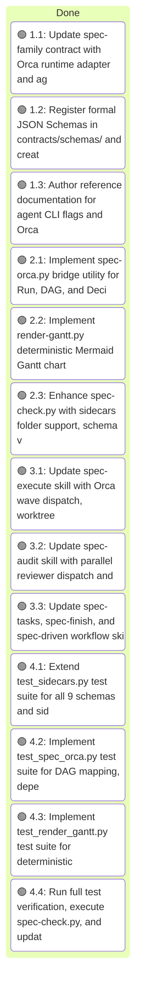
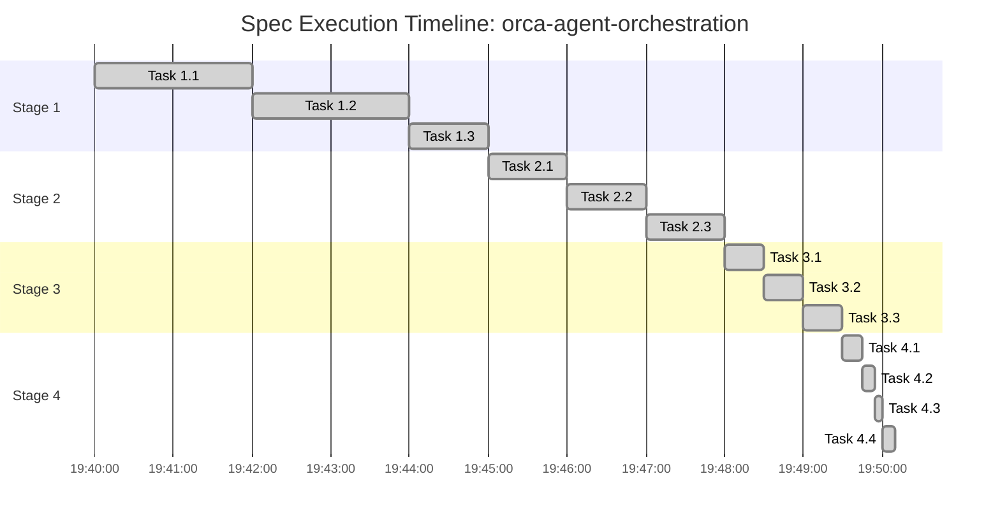

# Execution: Orca Multi-Agent Task Orchestration in Spec-Driven Skills

<!-- spec-nav:start -->
**Spec navigation:** [State](00_state.md) · [Discovery](01_discovery.md) · [Requirements](02_requirements.md) · [Design](03_design.md) · [Tasks](04_tasks.md) · [Execution](05_execution.md)
<!-- spec-nav:end -->

## Execution Overview

Implementation of Orca multi-agent task orchestration, JSON sidecar schemas, deterministic Mermaid Gantt generation, and budget/quota-aware model routing across all 4 stages.

## Execution Timing

### Task Board

### Run Intervals

| Run ID | Started UTC | Stopped UTC | Elapsed Seconds | Outcome |
|---|---|---|---|---|
| run-orca-1 | 2026-08-10T19:40:00Z | 2026-08-10T19:50:00Z | 600 | complete |

### Task Attempt Intervals

| Run ID | Stage/Wave | Task | Attempt | Started UTC | Stopped UTC | Elapsed Seconds | Outcome |
|---|---|---|---|---|---|---|---|
| run-orca-1 | Stage 1 | 1.1 | 1 | 2026-08-10T19:40:00Z | 2026-08-10T19:42:00Z | 120 | verified |
| run-orca-1 | Stage 1 | 1.2 | 1 | 2026-08-10T19:42:00Z | 2026-08-10T19:44:00Z | 120 | verified |
| run-orca-1 | Stage 1 | 1.3 | 1 | 2026-08-10T19:44:00Z | 2026-08-10T19:45:00Z | 60 | verified |
| run-orca-1 | Stage 2 | 2.1 | 1 | 2026-08-10T19:45:00Z | 2026-08-10T19:46:00Z | 60 | verified |
| run-orca-1 | Stage 2 | 2.2 | 1 | 2026-08-10T19:46:00Z | 2026-08-10T19:47:00Z | 60 | verified |
| run-orca-1 | Stage 2 | 2.3 | 1 | 2026-08-10T19:47:00Z | 2026-08-10T19:48:00Z | 60 | verified |
| run-orca-1 | Stage 3 | 3.1 | 1 | 2026-08-10T19:48:00Z | 2026-08-10T19:48:30Z | 30 | verified |
| run-orca-1 | Stage 3 | 3.2 | 1 | 2026-08-10T19:48:30Z | 2026-08-10T19:49:00Z | 30 | verified |
| run-orca-1 | Stage 3 | 3.3 | 1 | 2026-08-10T19:49:00Z | 2026-08-10T19:49:30Z | 30 | verified |
| run-orca-1 | Stage 4 | 4.1 | 1 | 2026-08-10T19:49:30Z | 2026-08-10T19:49:45Z | 15 | verified |
| run-orca-1 | Stage 4 | 4.2 | 1 | 2026-08-10T19:49:45Z | 2026-08-10T19:49:55Z | 10 | verified |
| run-orca-1 | Stage 4 | 4.3 | 1 | 2026-08-10T19:49:55Z | 2026-08-10T19:50:00Z | 5 | verified |
| run-orca-1 | Stage 4 | 4.4 | 1 | 2026-08-10T19:50:00Z | 2026-08-10T19:50:10Z | 10 | verified |

### Execution Gantt

